# Photo-Club

  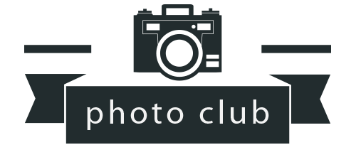

#### [웹사이트 방문하기](https://photo-club-korea.herokuapp.com/)

## 프로젝트 소개

평소 사진과 영상찍는 것을 좋아하는 취미를 가지고 있는 저는 실제로 사진 동호회를 중심으로 한 커뮤니티 사이트를 만들어보고 싶었습니다. 각자 자신만의 개성과 작품성을 가지고 있는 직접 찍은 사진들을 사이트에 올려 다함께 공유하고 사진과 모임에 관련된 정보 교류를 게시판을 통해 편리하게 할 수 있는 사이트를 직접 만들어 운영해보는 것을 목표로 이 프로젝트를 시작하였습니다. 정말로 동호회를 만들게 되면 이 프로젝트의 사이트를 통해 운영해도 될 만큼 구축하는 것이 궁극적인 목표였습니다.

 

## 프로젝트 기능

실제로 회원들을 관리하게 된다면 어떻게 효율적으로 편리하게 할 수 있을지 고민하며 떠오른 기능들을 실제로 스스로 구현해보는 시간을 갖게된 뜻깊은 프로젝트였습니다. 

* jwt, bcrypt 을 활용한 로그인 인증, 회원가입, 개인 프로필 조회 및 수정 기능.

* 정보 교류 목적의 CRUD 중심의 가입인사, 모임 후기 커뮤니티 게시판. 검색, 페이징, 게시판 글쓰기, 삭제, 수정, 조회(댓글 갯수, 방문수, 이미지 파일 유뮤 표시), 댓글 기능. 로그인 인증 후에 게시글을 쓰거나 조회할 수 있도록 보안 설정을 해두었으며 개인이 작성한 글과 댓글만이 수정 삭제할 수 있는 권한 설정 또한 추가.

* 포토 중심의 CRUD 형식의 장르별 카테고리 갤러리. 마찬가지로 검색, 페이징, 게시판 글쓰기, 삭제, 수정, 조회, 좋아요/싫어요 가 가능하며 로그인 인증 후에 포토를 올리거나 조회할 수 있도록 보안 설정을 해두었으며 개인이 작성한 글과 댓글만이 수정 삭제할 수 있는 권한 설정 추가.

* 다음 모임 장소를 표시하는 지도 API 기능. [회원 관리 시스템](https://github.com/k0502s/Member-Admin-System)에서 모임 장소 업데이트 가능.

* 회원들의 문의 사항을 챗봇으로 데이터를 받아내어 DB에 저장하는 기능. [회원 관리 시스템](https://github.com/k0502s/Member-Admin-System)에서 문의 사항 데이터 view로 직관적으로 확인 가능.

* 홈 화면에서 다양한 카테고리로 접근 가능한 조회 리스트들.

* 모바일 디바이스에 대응한 반응형 CSS 스타일링.

 

## 웹사이트 화면

|             홈(로그인 및 회원가입)              |           포토 갤러리 리스트            |
| :-------------------------: | :---------------------------: |
| 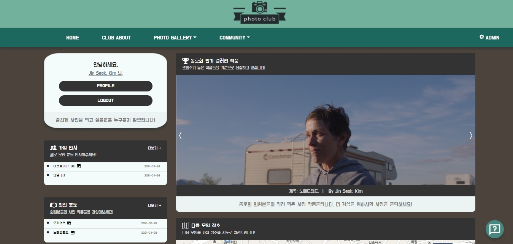 | 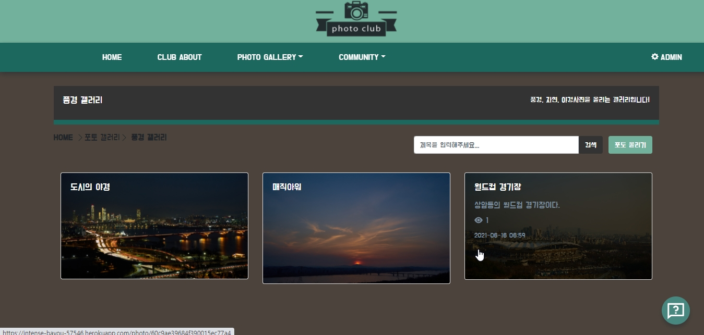 |

|            커뮤니티 게시판 리스트             |            포토 디테일 페이지           |
| :---------------------------: | :--------------------------: |
| 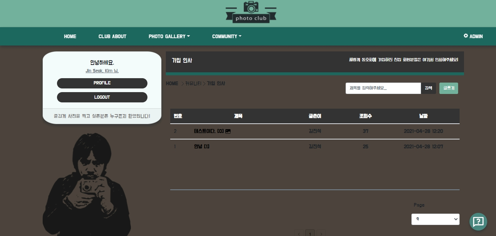 | 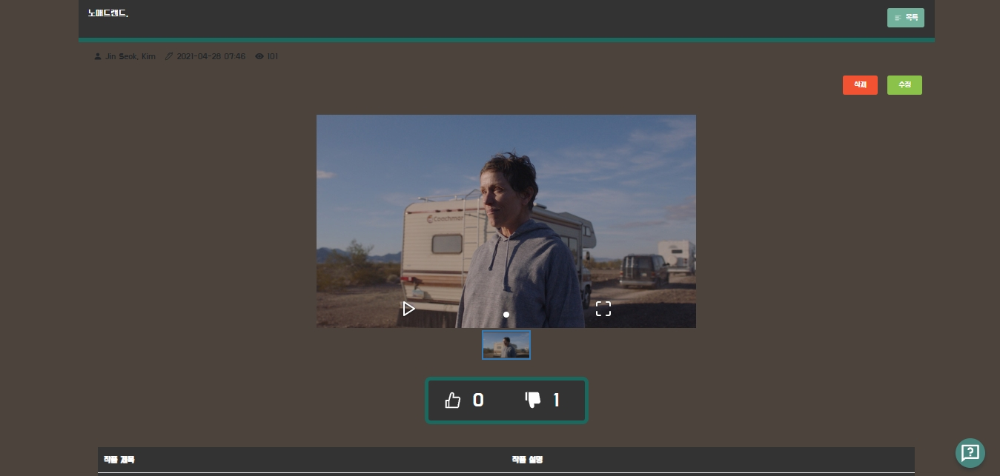 |

|             커뮤니티 디테일 페이지              |              포토 추가 페이지             |
| :---------------------------: | :--------------------------: |
| 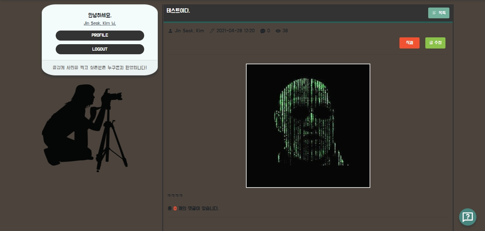 | 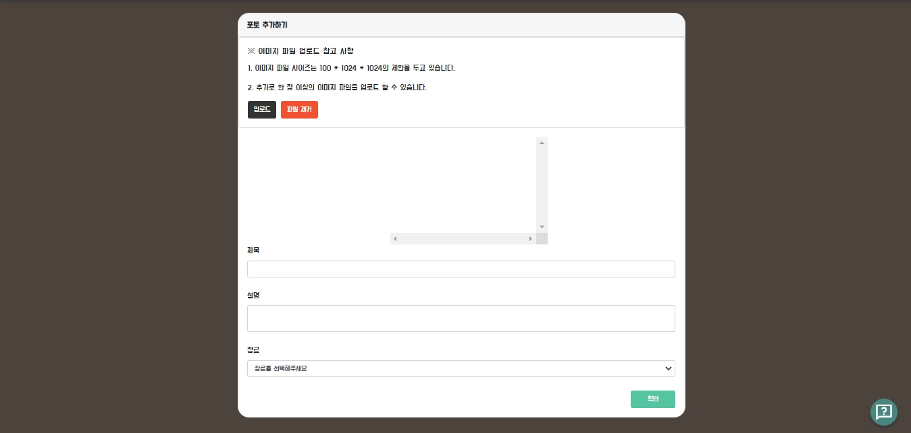 |
|             게시판 글쓰기 페이지              |              챗봇             |
| :---------------------------: | :--------------------------: |
| 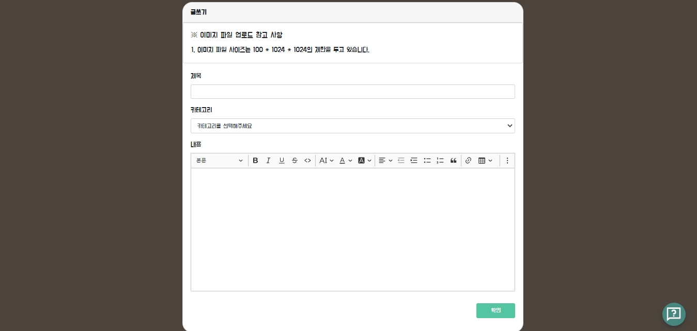 | 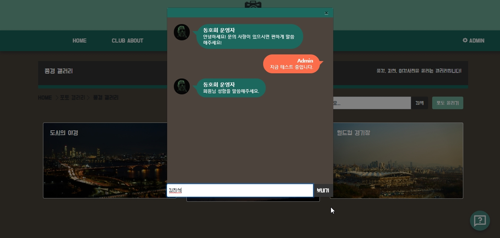 |
|             지도 API             |              프로필             |
| :---------------------------: | :--------------------------: |
| 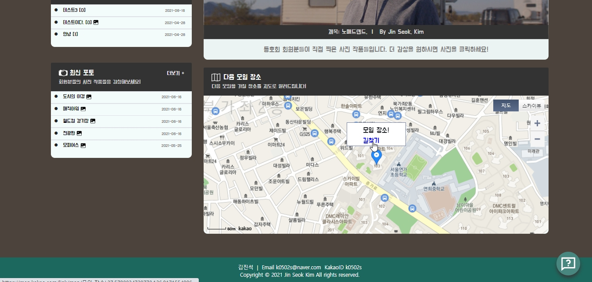 | 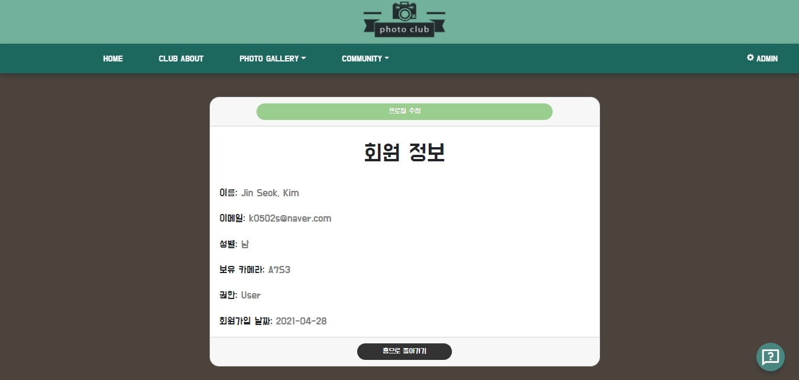 |
|             프로필 수정 페이지             |              동호회 소개 페이지             |
| :---------------------------: | :--------------------------: |
| 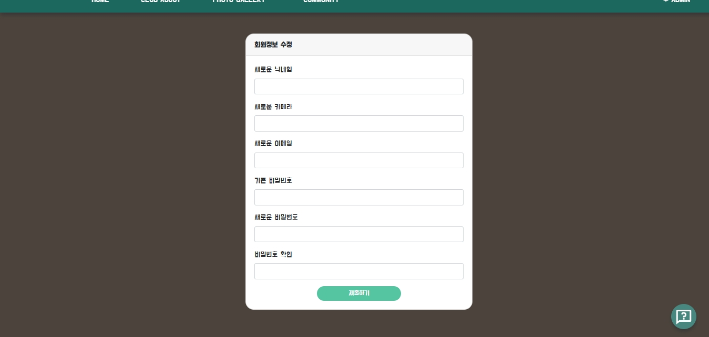 | 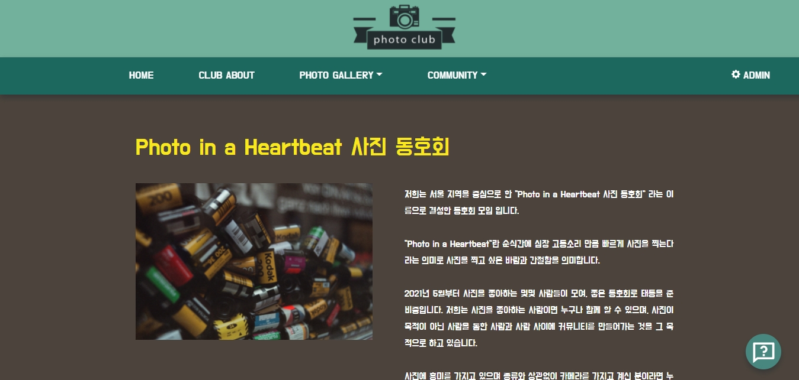 |

 

## 기술 스택

|               UI 라이브러리                |                      상태 관리                       |                  비동기 상태 관리                   |                스타일링                 |
| :----------------------------------------: | :-----------------------------------------------: | :----------------------------------------: | :---------------------------------------------: |
|  |  |  | 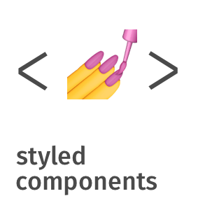 |

|                        서버                        |                        DB                        |                        Transcompiler                        |                         테스트 코드                        | 
|:----------------------------------------------------: | :---------------------------------------: | :---------------------------------------------------------: | :--------------------------------------------: |
| 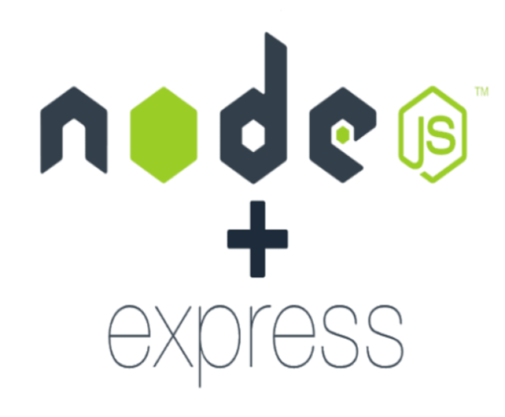 |  |  |  |
|                오픈 API-1                  |                 오픈 API-2                  |                   오픈 API-3              |
| :-----------------------------------------: | :---------------------------------------: | :---------------------------------------: |
|  | 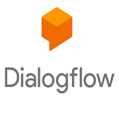 |  |

 

## 프로젝트를 진행하며 어려웠던 점.

* 

* 

* 

 

## 프로젝트를 진행하며 아쉬웠던 점.

* 프로젝트 코드들의 더 효율적인 리펙토링이 부족하다는 느낌을 받았습니다. 최대한 코드를 정리하였지만 경험적인 부분에서 많은 부족함을 깨달았습니다.

* TypeScript의 타입 지정에 대한 코드 활용에도 아직 기초적인 부분만을 적용할 수 있어 더 아름다운 코드로 TypeScript을 적용하지 못한 것이 아쉬웠습니다.

 

# 여러 기술을 사용하며 느낀점과 배운점들

## - UI 라이브러리와 상태 관리 - React.js와 Redux, Redux-Saga

 * 프로젝트를 진행하면서 UI 라이브러리로 [React.js](https://github.com/facebook/react)을 사용하였습니다. React.js을 사용한 이유로 처음으로 배운 UI 라이브러리이기도 하였으며 제일 많이 쓰이는 라이브러리라고 알고 있었기 때문이었습니다. 프로젝트를 통해 왜 React.js을 쓰는지 알게된 점이 가장 큰 의미가 있었습니다. React.js을 쓰면서 실제 실무에서 생상성이 확실히 좋을 것이라는 느낌을 받았습니다. 앞으로 React.js에 익숙해진다면 더욱 생상성의 시너지가 붙을 것 같다고도 생각하게 되었습니다. 특히 함수형 Hook을 사용하면서 React.js는 더욱 직관적인 개발을 할 수 있게 되었다고 생각하며 앞으로의 React.js 전망은 유망하다고 생각합니다.

 * [Redux](https://github.com/reduxjs/redux), [Redux-Saga](https://github.com/redux-saga/redux-saga)의 비동기 상태 관리는 React.js의 생상성을 더욱 더 높여주는 스킬이었습니다. 처음에 이 스킬을 공부하고 나서 워낙 낯선 개념이기도 하였고 헷갈리는 스킬이라고 생각하여 프로젝트를 하기 전에는 Redux을 왜 써야하는지 느낌을 받지 못하고 있었습니다. 초반에 세팅할 것도 많고 오류가 많이 등장하여 익숙해지는데 끙끙 앓았던 것 같았습니다. 하지만 프로젝트를 통해 Redux, Redux-Saga을 투입하여 사용해본 결과 실제 실무에서 스케일이 큰 프로젝트에서는 확실히 필요한 스킬이라고 깨닫게 되었습니다. 비록 개인 프로젝트에서는 Redux 상태관리가 불필요할지는 몰라도 스케일이 큰 프로젝트의 깊숙이 뿌리내린 수 많은 컴포넌트들이 있다면 Redux 상태관리는 필수라고 생각합니다.

 

## - 스타일링 - Styled-Components과 Reactstrap, material-ui

* CSS 스타일링을 위해 [Styled-Components](https://github.com/styled-components/styled-components)을 사용하였습니다. 프로젝트를 진행하기 전에는 CSS는 CSS 그 자체로 혹은 Sass을 이용하여 스타일링을 하였지만 이번 프로젝트에서는 컴포넌트를 CSS-in-JS 방식으로 스타일링 하는 Styled-Components을 활용한 방식을 메인으로 사용하였습니다. 사실 처음에는 CSS-in-JS 방식이 낯설어 익숙한 CSS나 Sass을 쓸까 생각하기도 하였지만 이번 프로젝트로 Styled-Components을 통한 CSS-in-JS 방식에 익숙해지자 React.js 환경에서 보통 CSS나 Sass보다 Styled-Components이 훨씬 가독성이 좋으며 추후 유지보수 측면에서 우의를 차지하고 있다고 생각하게 되었습니다. 그만큼 사용할 수 있으면 매우 효율적이고 훌륭한 스킬이라고 알게되었습니다. 특히 React.js 환경에서 props을 활용한 CSS 스타일링은 개발하면서 정말 마음에든 스킬이었습니다.

* 더 높은 생상성을 위하여 CSS 라이브러리를 활용하기도 하였습니다. [Reactstrap](https://reactstrap.github.io)과 [material-ui](https://github.com/mui-org/material-ui)을 활용하였습니다. 레이아웃이라든지 간단한 Box 카드, Button 등등을 라이브러리를 통하여 더욱 빠르게 스타일링 할 수 있는 경험을 해보게 되었습니다. 특히 아직 부족한 실력에 레이아웃을 설계하는데 힘이 들었는데 라이브러리의 도움을 많이 받아 원활하게 원하는 view을 얻을 수 있었습니다. 특히 모바일 디바이스의 레이아웃 대응에도 매우 도움이 되었습니다.

 

## - 서버와 DB - Node.js + Express와 MongoDB

* 서버는 JS을 통해 서버를 구축할 수 있는 [Node](https://github.com/nodejs/node) + [Express](https://github.com/expressjs/express)을 활용하였습니다. 프론트엔드를 희망하는 저는 JS 위주의 언어를 공부하였기에 JS로만 서버를 구축할 수 있다는 것에 메리트가 있다고 생각하여 프로젝트를 완성하는데 Node + Express을 선택하게 되었습니다. 

* 간단한 CRUD Restful API을 작성해보는 경험을 하게되었으며 클라이언트와 연동해보는 경험을 통해 CROS 정책에 관한 이해와 대처 방법 또한 알게 되었고 실제 실무에서 프론트엔드로서 백엔드 개발자분들과 원활한 협업과 소통이 되기 위한 역량을 조금이나마 쌓게 되었다고 생각합니다. 실제 웹의 데이터와 서버가 어떤 사이클로 작동하는지 확실히 이해하게된 뜻 깊은 스킬 경험이었습니다. 특히 JS의 async await, Promise와 같은 비동기 문법이 많이 사용하게 되어 비동기 문법에 대해서도 공부 및 이해 하는데 매우 도움이 되었습니다.

* DB는 프로젝트를 시작하기 전 [Mysql](https://github.com/mysql)과 [MongoDB](https://github.com/mongodb/mongo) 둘 중 어떤 종류의 DB을 써볼까 고민했었습니다. 결국 MongoDB을 선택하였습니다. Mysql이 기본이고 많이 쓰인다고 들었지만 MongoDB는 Document로 데이터를 저장하며 더 다향하게 데이터 타입을 헨들링할 수 있어 빠르게 프로젝트에 적용할 수 있다는 장점에 마음이 이끌렸습니다. 또 앞으로 많은 기업들이 Document 객체 지향과 조합이 좋아 편리하기 때문에 많이 선택 스킬로 채택된다는 소식을 듣게 되어 써봐야겠다고 확신하게 되었습니다. 아주 기초적이지만 DB의 기본 메서드들을 활용하며 CRUD 쿼리들을 만들어내는 것에 재미를 느끼기고 하였습니다. 하지만 워낙 다양한 메서드들과 사용 방법들이 있어 이 방대한 사용 설명서를 어렵게 검색하여 찾는 노력, 때로는 알 수 없는 오류에 부딫히는 어려움을 겪기도 하였습니다.

 

## - Module bundler와 Transcompiler - Webpack과 Babel

* 

* 

* 

 

## - 테스트 코드 - Jest와 React testing library

* 이번 프로젝트에 테스트 코드 또한 작성하게 되었습니다. 지금까지 코드만 짜고 로컬에서 실행시켜 보고 눈으로만 확인하는 테스트로 만족하고 있었지만 아예 실제로 테스트 코드라는 독자적인 코드를 따로 입력하여 테스트를 돌린 다는 개념은 무척 어렵게 느껴졌고 배우면서 어떻게 테스트 코드를 작성할지 막막하였던 기억이 있었습니다. 하지만 어떻게 테스트 코드를 작성하여 어떤 식으로 사이클이 돌아가는지 한번 익숙해지니 쭉 나아가게 된 스킬 적용이었습니다. 확실히 테스트 코드를 작성하는 것이 프로젝트가 테스트를 하지 않았을 때보다 견고해진다는 것을 느끼게 되었습니다. 실제 실무에서도 이러한 테스트가 있다면 생산성이 방해되는 디버깅을 피할 수 있고 미리 예방할 수 있다는 것에 좋을 것 같다고 생각하게 되었습니다.

* 테스트 프레임워크로 Jest을 사용하고 [react testing library](https://github.com/testing-library/react-testing-library)을 사용하여 React 환경에서의 핵심인 DOM 컴포넌트를 중심적으로 테스트 코드 작성에 집중 할 수 있었습니다. Redux 스토어에서 컴포넌트가 잘 랜더링 되는지, Redux의 액션 및 리듀서가 상태를 잘 업데이트하고 잘 랜더링하는지, React 라우터가 잘 작동하는지 등 기능적인 부분들을 테스트하는 경험을 하게 되었습니다. 또 Redux Saga의 비동기 테스트를 더 손쉽게 테스트 할 수 있는 [redux-saga-test-plan](https://github.com/jfairbank/redux-saga-test-plan)라는 라이브러리를 적용하여 테스트 해보는 등 다양한 시도와 경험을 하게 되었습니다.

* 솔직히 아직 모르는 많은 테스트 코드 문법이 존재하고 실제 실무에서도 빠르게 코드를 작성할 수 있는 역량까지 도달했다고 말할 수는 없다고 생각하여 개인 프로젝트를 통한 테스트 코드 경험은 앞으로 어떤 방향으로 테스트 코드 작성에 대한 공부에 접근할 수 있는지 알아보았다고 말하고 싶습니다. 

 

## - 오픈 API- KakoMap, Dialogflow, CKEditor5 

* 오픈 API을 적용하는 경험 또한 하게 되었습니다. 아주 간단한 API 적용이었지만 간단한 경험을 통해 다른 API 적용에 겁을 먹지 않을 수 있다는 역량을 갖게 되었다고 말하고 싶습니다. 이 프로젝트에서 적용한 오픈 API는 [KakaoMap](https://apis.map.kakao.com), [Dialogflow](https://dialogflow.cloud.google.com/), [CKEditor5](https://ckeditor.com/ckeditor-5)입니다.

* KakoMap을 통해 이 프로젝트에서는 다른 프로젝트인 [사진 동호회 사이트](https://github.com/k0502s/Photo-Club)의 다음 모임 장소 지도 데이터를 업데이트 할 수 있도록 스스로 오픈 API 데이터를 클라이언트와 서버 및 DB을 활용하여 나만의 기능을 만들어 내는 뜻 깊은 경험을 하게 되었습니다.

* 

 